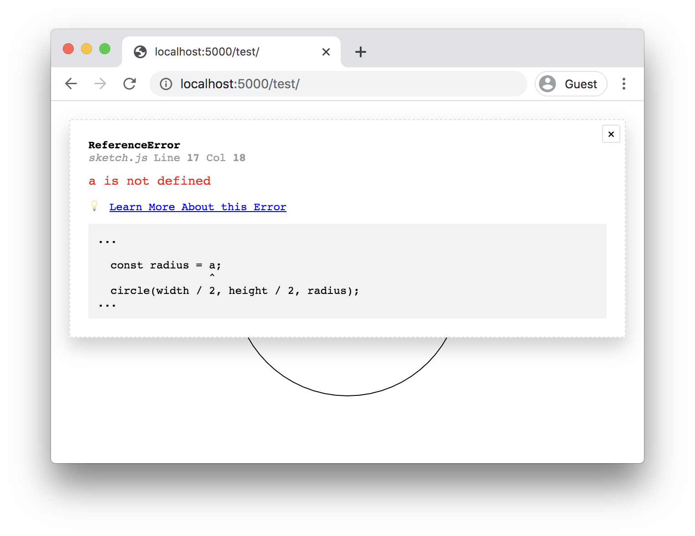

# error-help

A standalone JavaScript file ([error-help.js](./error-help.js)) that you can add to your HTML to improve the debugging experience when developing HTML/JS projects, without having to open your DevTools console.

This is particularly targeted towards new JavaScript coders and making it a bit easier to get started with the language.



Features:

- On error, logs the file, line number, column, and error message
- If possible, shows a link to MDN docs explaining the error, for example *["x" is not defined](https://developer.mozilla.org/en-US/docs/Web/JavaScript/Reference/Errors/Not_defined)*.
- Also fetches the text of the originating file to show the code causing the error
- Can optionally de-duplicate console spam, in order to clean it up a bit (usueful for animation-based projects that may log errors at 60FPS)

Gotchas:

- Best used for static workflows (i.e. no Webpack/Parcel/etc bundlers)
- You may want to disable this for production

## Usage with CDN

Include like so in your project, in the HEAD before all other script tags:

```html
  ...
  <head>
    <script src="https://cdn.jsdelivr.net/npm/error-help@1.0.8/error-help.js"></script>
  </head>
  ...
```

## Usage without CDN

You can download [error-help.js](./error-help.js), add it to your folder, and locally reference it like so:

```html
  ...
  <head>
    <script src="./error-help.js"></script>
  </head>
  ...
```

## Log Spam Deduplication

If you pass `dedupe-logs` attribute to the script tag, it will deduplicate console logs that repeat 10 or more times within 1.5 second intervals. This is helpful when working on CodeSandbox in an animated sketch (e.g. with p5.js), to avoid 60FPS console logs slowing down the browser experience.

Example:

```html
  ...
  <head>
    <script
      src="https://cdn.jsdelivr.net/npm/error-help@1.0.8/error-help.js"
      dedupe-logs></script>
  </head>
  ...
```

## License

MIT, see [LICENSE.md](http://github.com/mattdesl/error-help/blob/master/LICENSE.md) for details.
